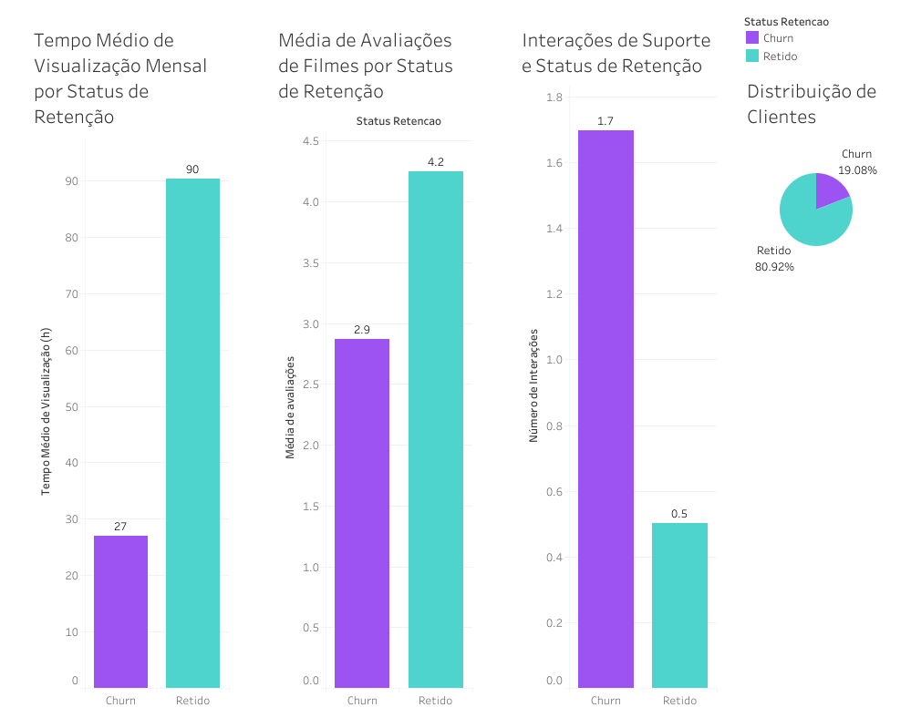
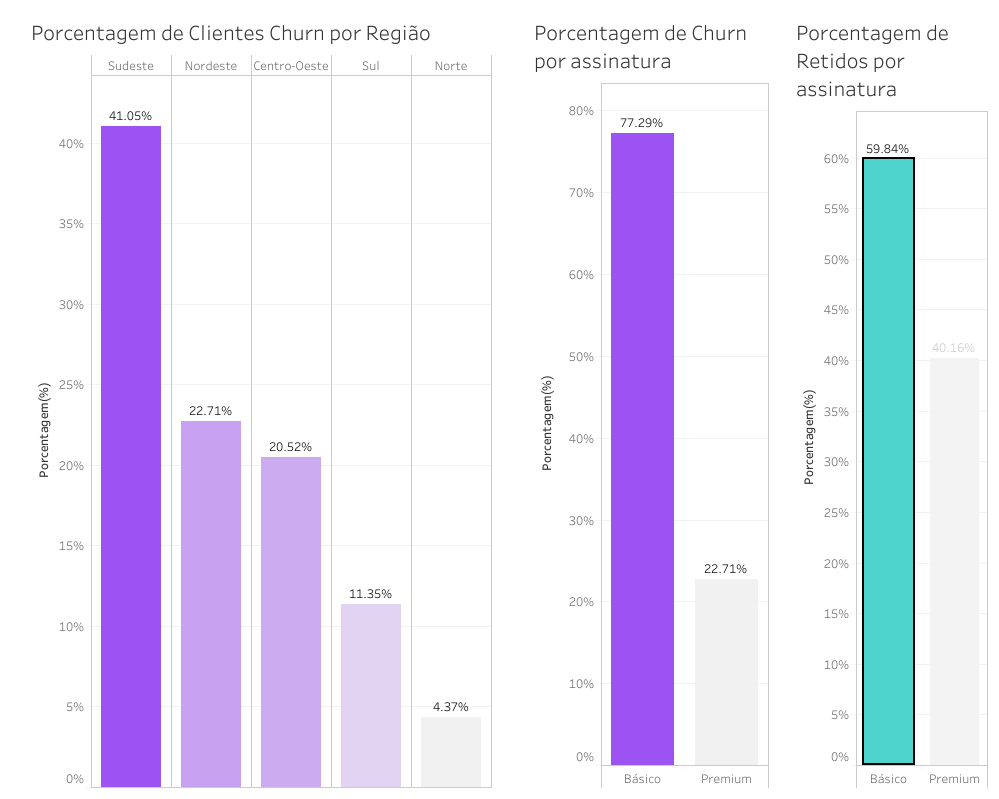

# 🎬 Análise de Churn em Clientes de Streaming - R e Tableau

## 🎯 Objetivo do Projeto

Este projeto de Ciência de Dados tem como objetivo identificar os principais fatores (engajamento, demografia e uso) que predizem a desativação (Churn) de clientes de um serviço de streaming. O objetivo final é fornecer recomendações de negócio acionáveis para a área de Retenção e Marketing.

## 🔗 Resultado Final (Relatório Interativo)

O relatório completo da análise, incluindo gráficos e tabelas, foi gerado através do R Markdown e está publicado no GitHub Pages.

➡️ **[Acessar Relatório Completo (HTML)](https://shaiditt.github.io/projeto_streaming/)**

---

## 🔑 Principais Insights e Recomendação de Negócio

A análise dos dados resultou em uma recomendação clara com foco no segmento de maior risco:

## 🔑 Principais Insights e Recomendação de Negócio

A prioridade de retenção deve ser direcionada aos clientes de **Plano Básico na Região Sudeste**, que são responsáveis pela maior parcela do *Churn* total.

### A Análise Revela que o Principal Preditor de Cancelamento É:

* **Baixo Engajamento:** Clientes *Churn* registram um tempo médio de visualização de apenas **27 horas mensais** (contra 90 horas dos retidos).
* **Insatisfação Notável:** Evidenciada por **baixas avaliações de filmes (2.9)**, contra 4.2 dos Retidos.
* **Alta Frequência de Interações de Suporte:** Média de **1.7 por cliente**, contra 0.5 dos Retidos.

### Recomendação de Negócio (Ação Proposta)

> **Recomendamos a criação imediata de um programa de intervenção proativa focado nesses clientes de risco (abaixo de 30h e/ou com múltiplas interações de suporte) na Região Sudeste para oferecer suporte especializado ou um *trial* gratuito do Plano Premium, visando elevar a satisfação e o uso da plataforma acima do limiar crítico de 30 horas.**

---

## 🛠 Reprodutibilidade e Tecnologia

Este projeto foi construído inteiramente utilizando o ambiente R e o pacote `tidyverse`, garantindo que toda a análise seja auditável e replicável.

### Stack Tecnológico
* **Linguagem:** `R`
* **Documentação/Relatório:** `R Markdown` (Gerado em `index.html`)
* **Limpeza e Manipulação:** Pacotes `tidyverse` (principalmente `dplyr`)
* **Visualização (Exploratória/Dashboard):** `Tableau`

### Arquivos e Etapas
| Arquivo | Descrição | Foco |
| :--- | :--- | :--- |
| **`projeto_streaming_final.Rmd`** | Contém todo o código-fonte da análise, desde o tratamento de duplicatas até a geração dos gráficos (Knit). | **Código Fonte R** |
| **`analise_streaming_final.csv`** | Conjunto de dados finalizado após a etapa de limpeza e tratamento de valores ausentes. | **Dados Limpos** |
| **`imagens_tableau/`** | Pasta com os screenshots dos dashboards criados no Tableau. | **Visualização** |

### Como Reproduzir a Análise

Para rodar esta análise em sua máquina:

1.  Clone este repositório para o seu computador.
2.  Abra o arquivo `projeto_streaming_final.Rmd` no RStudio.
3.  Certifique-se de que os pacotes `tidyverse` e `janitor` estão instalados.
4.  Clique no botão **Knit** para gerar o arquivo `index.html` localmente.

---

## 📈 Dashboard de Visualização

O dashboard interativo completo pode ser acessado diretamente no Tableau Public para uma experiência de exploração mais profunda.

➡️ **[Acessar Dashboard no Tableau Public (Interativo)](https://public.tableau.com/app/profile/shaini.dittberner/viz/AnlisedeEngajamentoeRotatividadeChurndeClientesemumaPlataformadeStreaming/Dashboard1)**



## 🧑‍💻 Autor

* **[shaiDitt]** - *Cientista de Dados em Formação* ```

---
